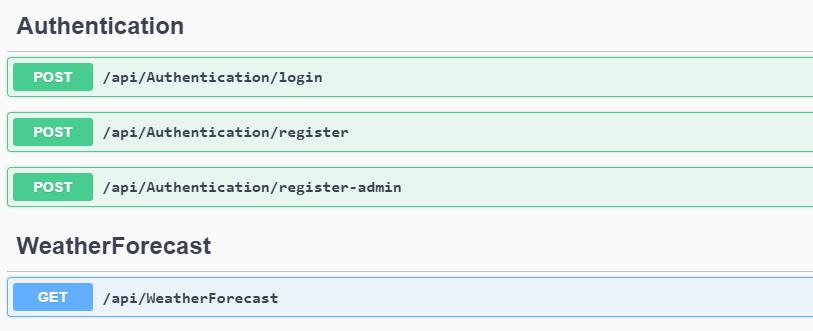
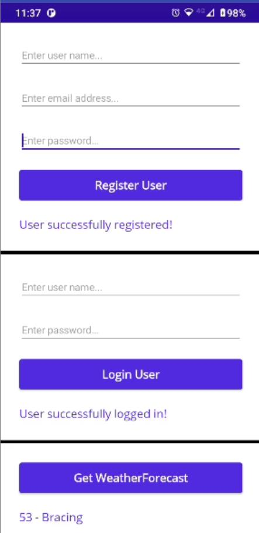

# Consume an ASP.NET Core 6.0 WebAPI from .NET MAUI

In this repository, you will find an **ASP.NET Core WebAPI application** that implements **JWT authentication** and a **.NET MAUI application** that consumes the protected WebAPI.

The  WebAPI application is based upon the article [JWT Authentication and Authorization in .NET 6.0 with Identity Framework](https://www.c-sharpcorner.com/article/jwt-authentication-and-authorization-in-net-6-0-with-identity-framework/) written by **Sarathlal Saseendran**.

WARNING: The two applications are by no means production-ready and serve only to demonstrate the basic principles to **consume a protected ASP.NET Core WebAPI with a .NET MAUI application**.

## How to run the projects

To follow along with this article you will need to install **Visual Studio 2022 Preview**. You can download the preview version for free [here](https://visualstudio.microsoft.com/vs/preview/#download-preview).

Make sure you install following workloads:

* ASP.NET and web development
* Mobile development with .NET
* Universal Windows Platform development

### Clone the repository

Open a command prompt in your computer and enter the command below:

```bash
    git clone https://github.com/bartvanhoey/ConsumeWebAPIfromMAUI.git
```

### Setup and run WebAPI

#### Create and apply migrations

First, you need to create the database and tables needed before running the application.

Open a **command prompt** in the **root folder of the WebAPI project** and run the command below to apply the **Initial** migration to the database.

```bash
    dotnet ef database update
```

#### Run the ASP.NET Core WebAPI application

Open a **command prompt** in the **root folder of the WebAPI project** and run the command below:

```bash
    dotnet watch
```

After running the **dotnet watch** command a **Swagger page with API endpoints** will be displayed in a browser window.



### Ngrok to the rescue

Because you are running the WebAPI application on your local computer, the register API endpoint is reachable on [https://localhost:\<your-port-number\>/api/authentication/register](https://localhost:<your-port-number>/api/authentication/register).

Although you can test out the API endpoints on your local machine, it will fail in .NET MAUI or Xamarin.Forms applications. They interpret the localhost address as their own localhost address (mobile device or emulator) and not the localhost address of your computer.

To overcome this problem you can **make use of ngrok**. With ngrok you can **mirror your localhost address to a publicly available url**.

#### Download and install ngrok

Go to the [ngrok page](https://ngrok.com/), create an account and download and install Ngrok.

#### Run the Ngrok command

Open a command prompt and enter the command below to start ngrok

```bash
ngrok.exe http -region eu https://localhost:<replace-with-api-port-number>/
```

After running this command, you will receive the following output. The API is now publicly available on [https://f7db-2a02-810d-98c0-576c-647e-cd22-5b-e9a3.eu.ngrok.io](https://f7db-2a02-810d-98c0-576c-647e-cd22-5b-e9a3.eu.ngrok.io)


#### Copy the ngrok url

Copy the **lower forwarding url** as you will need it in the .NET MAUI application.

#### Run .NET MAUI application

#### Paste the ngrok url

Open the  **MainViewModel** in the **ViewModels folder** and **replace the BaseUrl with the ngrok url** you copied in the previous section.

```csharp
    private const string BaseUrl = "<your-ngrok-url-here>";
```

#### Run the .NET MAUI app



In the **MainViewModel** class of the .NET MAUI app. you find **the 3 main methods** of the application. These 3 methods make a call to the WebAPI endpoints

* **RegisterUserAsync()** calls the **{BaseUrl}/api/authentication/register** API endpoint
* **LoginUserAsync()** calls the **{BaseUrl}/api/authentication/login** API endpoint (receives accesstoken from API)
* **GetWeatherForecastAsync()** calls the **{BaseUrl}/api/weatherforecast** API endpoint

Run the **ApiConsumerApp** and test it out in the following order.

1. Click **Get WeatherForecast** button -> You will receive an **Unauthorized** message
2. Register a user and click **Register User** button -> You will receive a **User successfully registered!** message.
3. Login with the credentials of the registered User ->  You will receive a **User successfully logged in!** message.
4. Click **Get WeatherForecast** button -> You will receive a **Weather forecast** message


## Conclusion

In this article, we have seen how to consume a **.NET 6.0 ASP.NET Core Web API protected by JWT Authentication** with a **.NET MAUI app**.
